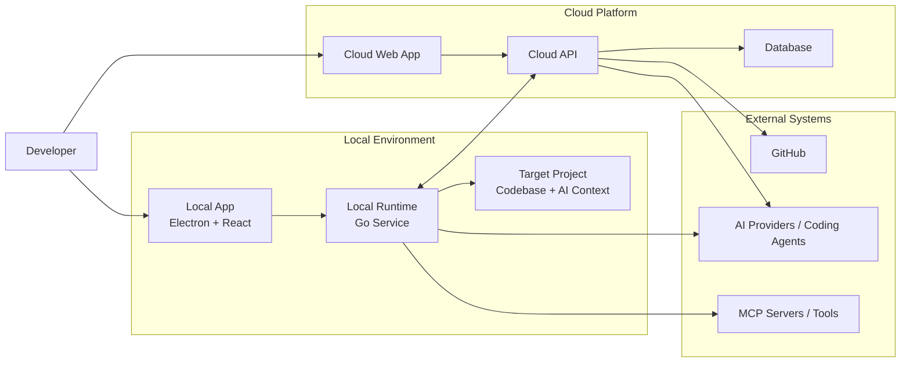
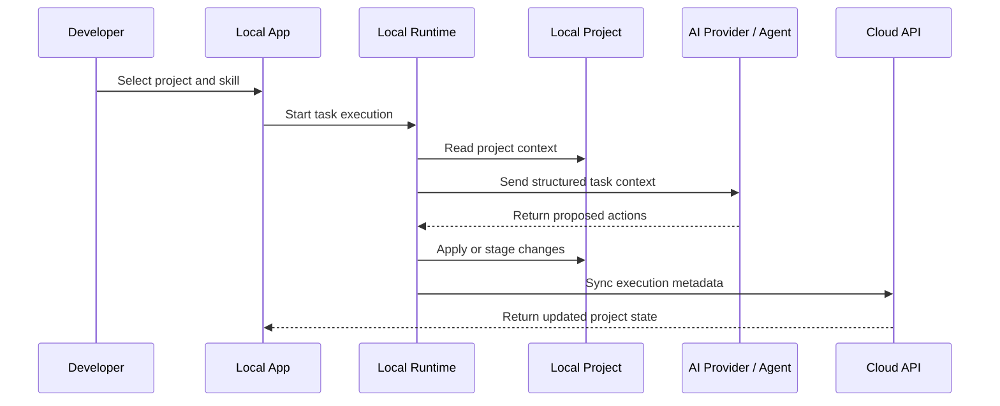

<div align="center">

# SWEOrchestrAI

### AI Engineering System for orchestrating software projects, agents, roadmaps, skills, and local/cloud development workflows.

SWEOrchestrAI is an experimental software engineering orchestration platform designed to turn AI-assisted development into a structured, repeatable, and project-aware workflow.

Instead of using AI tools as isolated chat-based assistants, SWEOrchestrAI provides a system where projects have persistent context, reusable engineering skills, roadmaps, local execution capabilities, cloud synchronization, and clear links between product planning and code execution.

</div>

---

## What is SWEOrchestrAI?

SWEOrchestrAI is a portfolio-grade AI engineering system built around one main idea:

> AI should not only generate code.
> It should understand the project, follow engineering workflows, respect architectural context, and help execute software work in a structured way.

The system is designed to help developers and technical teams manage software projects through:

* Persistent project context.
* Roadmap-driven execution.
* Reusable AI engineering skills.
* Local-first development workflows.
* Cloud-based project visibility.
* GitHub and repository integrations.
* AI provider abstraction.
* Documentation, architecture decisions, and execution history.

---

## Core Concept

SWEOrchestrAI acts as an orchestration layer between:

* The developer.
* The project repository.
* Local development tools.
* AI providers and coding agents.
* Cloud project management services.
* GitHub repositories and engineering workflows.



---

## Repository Structure

SWEOrchestrAI is divided into five repositories, each with a clear responsibility.

| Repository                                                                               | Purpose                                                                                                               |
| ---------------------------------------------------------------------------------------- | --------------------------------------------------------------------------------------------------------------------- |
| [`sweorchestrai-overview`](https://github.com/YOUR_ORG/sweorchestrai-overview)           | Documentation hub, architecture, roadmap, diagrams, technical decisions, screenshots, and portfolio presentation.     |
| [`sweorchestrai-local-app`](https://github.com/YOUR_ORG/sweorchestrai-local-app)         | Desktop application built with Electron + React. Provides the local user interface.                                   |
| [`sweorchestrai-local-runtime`](https://github.com/YOUR_ORG/sweorchestrai-local-runtime) | Local runtime service built in Go. Handles project access, local execution, tool communication, and AI orchestration. |
| [`sweorchestrai-cloud-web`](https://github.com/YOUR_ORG/sweorchestrai-cloud-web)         | Cloud web frontend for dashboards, project visibility, roadmap management, and configuration.                         |
| [`sweorchestrai-cloud-api`](https://github.com/YOUR_ORG/sweorchestrai-cloud-api)         | Cloud backend API and database layer. Acts as the contract center of the system.                                      |

---

## Main Components

### Local App

The local application provides a desktop interface for interacting with projects, roadmaps, skills, local executions, and AI-assisted workflows.

Planned responsibilities:

* Project selection and workspace management.
* Local task execution interface.
* Skill selection and execution history.
* Local runtime status and configuration.
* Connection with cloud synchronization features.

Main technologies:

* Electron
* React
* TypeScript
* Vite
* Modern frontend tooling

---

### Local Runtime

The local runtime is the bridge between the desktop app, the local machine, target repositories, MCP servers, and AI providers.

Planned responsibilities:

* Read and manage local project context.
* Execute local commands safely.
* Communicate with AI providers or coding agents.
* Interact with MCP servers.
* Expose a local API to the desktop app.
* Synchronize relevant metadata with the cloud API.

Main technologies:

* Go
* Local HTTP / RPC-style communication
* File system access
* Process execution
* Tool and provider abstraction

---

### Cloud Web

The cloud web application provides centralized visibility over projects, roadmaps, skills, execution history, and system configuration.

Planned responsibilities:

* Project dashboards.
* Roadmap and milestone visualization.
* Skill catalog management.
* Execution tracking.
* Team/project configuration.
* Portfolio-level product demonstration.

Main technologies:

* React
* TypeScript
* Vite or similar frontend tooling
* API-driven architecture

---

### Cloud API

The cloud API acts as the contract center of the system.

Planned responsibilities:

* Project metadata.
* Roadmaps and milestones.
* Skills and workflows.
* Execution history.
* User and workspace management.
* Synchronization contracts.
* GitHub integration contracts.
* Cloud persistence.

Potential technologies:

* Java / Kotlin / Node.js backend stack
* PostgreSQL
* Redis where needed
* Docker
* REST APIs
* OpenAPI documentation
* CI/CD pipelines

---

### Overview Repository

The overview repository is the main documentation and portfolio hub.

It contains:

* Product explanation.
* Architecture diagrams.
* Repository map.
* Technical decisions.
* MVP roadmap.
* Demo screenshots.
* System walkthroughs.
* Skills documentation.
* MCP integration notes.

---

## Engineering Skills

SWEOrchestrAI is built around reusable engineering skills.

A skill defines a repeatable workflow that an AI agent can follow when assisting with software engineering work.

Examples:

| Skill                 | Purpose                                                                                |
| --------------------- | -------------------------------------------------------------------------------------- |
| Backlog Management    | Convert ideas, issues, and product goals into structured backlog items.                |
| Feature Development   | Guide the implementation of new features from context gathering to validation.         |
| Bug Investigation     | Analyze bugs, reproduce issues, inspect probable causes, and propose fixes.            |
| Code Review           | Review changes for correctness, maintainability, security, and architecture alignment. |
| Documentation         | Generate or improve technical documentation.                                           |
| Refactoring           | Improve code structure without changing external behavior.                             |
| Security Audit        | Inspect code and architecture for security risks.                                      |
| Infrastructure Design | Help design deployment, cloud, and infrastructure components.                          |
| Performance Analysis  | Identify bottlenecks and suggest improvements.                                         |

---

## Project Context Strategy

SWEOrchestrAI is designed to support structured project context.

A target project may include an AI-readable context folder, for example:

```txt
.ai/
├── project.md
├── architecture.md
├── roadmap.md
├── standards.md
├── backlog.md
├── decisions/
├── skills/
└── context/
```

The goal is to make AI-assisted development more reliable by giving agents access to explicit project knowledge instead of relying only on chat history.

---

## Local + Cloud Workflow

SWEOrchestrAI follows a hybrid local/cloud approach.



---

## Tech Stack

The system is intentionally polyglot, using different technologies where they make the most sense.

| Area                  | Technologies                               |
| --------------------- | ------------------------------------------ |
| Desktop App           | Electron, React, TypeScript                |
| Local Runtime         | Go                                         |
| Cloud Frontend        | React, TypeScript                          |
| Cloud Backend         | Java/Kotlin or Node.js, REST APIs, OpenAPI |
| Database              | PostgreSQL                                 |
| Cache / Async Support | Redis, queues where needed                 |
| DevOps                | Docker, Docker Compose, GitHub Actions     |
| Integrations          | GitHub, MCP servers, AI providers          |
| Documentation         | Markdown, Mermaid, ADRs                    |

---

## Architecture Principles

SWEOrchestrAI is designed around the following principles:

* **Local-first where execution matters.**
* **Cloud-first where visibility and coordination matter.**
* **Provider-agnostic AI execution.**
* **Explicit project context over implicit chat memory.**
* **Reusable engineering workflows over one-off prompts.**
* **Clear contracts between repositories.**
* **Documentation as part of the product.**
* **Portfolio-quality architecture and implementation.**

---

## MVP Goals

The first MVP aims to prove the full end-to-end flow:

1. Configure a local software project.
2. Define or load project context.
3. Select an engineering skill.
4. Execute an AI-assisted task through the local runtime.
5. Track execution results.
6. Synchronize metadata with the cloud API.
7. Visualize project state through the cloud web app.
8. Document the architecture and decisions in the overview repository.

---

## Current Status

SWEOrchestrAI is currently in early MVP development.

Initial focus:

* Repository setup.
* Architecture documentation.
* MVP roadmap definition.
* Local runtime design.
* Desktop app foundation.
* Cloud API contracts.
* Skills catalog definition.
* Portfolio-ready documentation.

---

## Why This Project Matters

This project explores several real-world software engineering concerns:

* AI-assisted development.
* Developer tooling.
* Local/cloud hybrid architecture.
* Desktop application architecture.
* Backend API design.
* Cross-repository system design.
* Project orchestration.
* Engineering workflow automation.
* Technical documentation.
* Architecture decision records.
* Portfolio-grade product presentation.

For portfolio purposes, SWEOrchestrAI demonstrates not only coding ability, but also system design, product thinking, architectural decision-making, documentation quality, and the ability to structure a multi-repository software platform.

---

## Author

Built as a personal software engineering portfolio project focused on AI engineering systems, developer tooling, local/cloud architecture, and modern software delivery workflows.

---

## License

Each repository may define its own license depending on its purpose and distribution model.

The overview and documentation repositories are intended mainly for product explanation, architecture, diagrams, and portfolio presentation.
