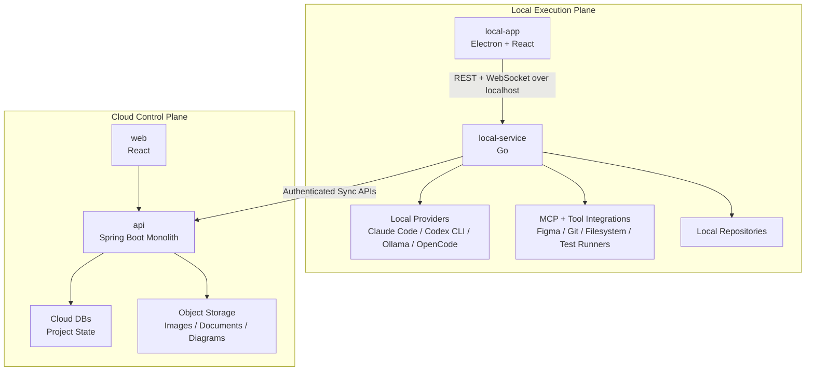

# SWEOrchestrAI

### Cloud-managed software delivery. Locally executed AI engineering.

SWEOrchestrAI is a hybrid local/cloud AI Project Manager for software engineering workflows.

It combines cloud-based project management with local AI agent execution, repository-aware automation, diagrams, design workflows, MCP integrations, and approval-gated coding operations.

---

## What is SWEOrchestrAI?

SWEOrchestrAI is an experimental AI engineering system designed to make AI-assisted software delivery more structured, traceable, and project-aware.

Instead of treating AI tools as isolated chat assistants, SWEOrchestrAI organizes software work around persistent project context, cloud project visibility, local execution, reusable engineering workflows, and explicit approval gates.

The project is currently in MVP architecture and foundation planning.

---

## Core Architecture

SWEOrchestrAI is split into two main planes:

| Plane | Purpose |
|---|---|
| Local Execution Plane | Runs local coding agents, provider adapters, MCP tools, repository operations, and approval-gated commands through the desktop app and Go local service. |
| Cloud Control Plane | Manages projects, users, requirements, backlog, diagrams, design portfolios, execution history, artifacts, and sync state. |

---

## Repositories

| Repository | Purpose | Stack |
|---|---|---|
| [`overview`](https://github.com/SWEOrchestrAI/overview) | Documentation, architecture, roadmap, ADRs, contracts, diagrams, and portfolio hub. | Markdown |
| [`api`](https://github.com/SWEOrchestrAI/api) | Cloud backend monolith for auth, persistence, sync, artifacts, project logic, and APIs. | Spring Boot, Kotlin/Java |
| [`web`](https://github.com/SWEOrchestrAI/web) | Cloud web app for project management, visibility, diagrams, design stages, and execution history. | React, TypeScript |
| [`local-app`](https://github.com/SWEOrchestrAI/local-app) | Local desktop UI for provider configuration, workspaces, runs, logs, and approvals. | Electron, React, TypeScript |
| [`local-service`](https://github.com/SWEOrchestrAI/local-service) | Go local execution service that connects to providers, MCP tools, local repos, and syncs with cloud. | Go |
| [`.github`](https://github.com/SWEOrchestrAI/.github) | Organization profile and public presentation. | Markdown |

---

## MVP Scope

The first MVP focuses on proving the hybrid local/cloud workflow:

- cloud-managed project state,
- local execution through `local-service`,
- Electron desktop app for local runs and approvals,
- cloud web app for project visibility,
- provider-agnostic local execution,
- REST + WebSocket communication between `local-app` and `local-service`,
- execution history and sync metadata,
- diagrams and design stage as first-class project areas,
- portfolio-grade architecture documentation.

---

## Key Principles

- Cloud-managed software delivery.
- Locally executed AI engineering.
- Provider-agnostic local execution.
- Approval-gated local operations.
- Project context over one-off prompts.
- Clear repository boundaries.
- Documentation as part of the product.

---

## Documentation

The full architecture, roadmap, ADRs, contracts, requirements, and diagrams are maintained in the [`overview`](https://github.com/SWEOrchestrAI/overview) repository.

Start there for:

- product vision,
- architecture overview,
- repository responsibilities,
- MVP roadmap,
- contracts,
- requirements,
- ADRs,
- security model,
- diagram and design-stage documentation.

---

## Current Status

SWEOrchestrAI is currently in MVP architecture and foundation planning.

Current focus:

- documentation and architecture source of truth,
- repository contract definition,
- implementation repo README expansion,
- `local-service` Go service foundation,
- mock local execution run with WebSocket logs and approval gates.

---

## Author

Built as a personal software engineering portfolio project focused on AI engineering systems, developer tooling, local/cloud architecture, project orchestration, and modern software delivery workflows.
